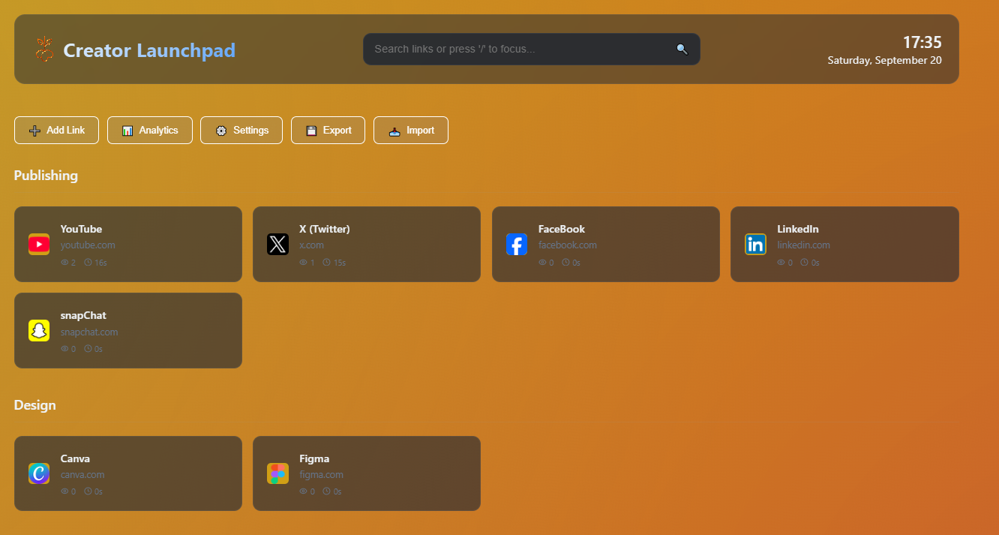

# 🚀 Creator Launchpad
A fast, private, and customizable browser homepage to organize all your essential links in one place. Created for content creators, developers, and power users who need more than the standard 10 shortcuts.

## The Problem
Google Chrome and many other browsers limit the number of shortcuts you can have on the default new tab page. For creators and professionals who rely on 20+ different platforms daily, this is a major workflow bottleneck.

## The Solution
Creator Launchpad replaces your new tab page with a beautiful, locally-hosted dashboard that you control. It's built with simple HTML, CSS, and JavaScript, runs entirely in your browser, and keeps all your data private on your own machine. No accounts, no tracking, just speed and efficiency.

## Features
- **Unlimited Links & Categories:** Organize as many links as you need into logical categories.
- **Drag & Drop Everything:**
  - Reorder entire categories to prioritize your workflow.
  - Move links between different categories with a simple drag.
- **Smart & Automatic:**
  - Auto-Favicons: Fetches website icons automatically.
  - Live Search: Instantly find any link. Use `/` or `Ctrl+K` to focus the search bar.
- **Deep Customization:**
  - Custom Logo: Click the logo to upload your own brand or image.
  - Theme Editor: Change background and accent colors to match your style.
- **100% Private & Local:** All your links, settings, and custom logos are stored securely in your browser's local storage. Nothing is ever sent to a server.

## Backup & Restore
Use the Export/Import feature to save your entire setup as a JSON file for backup or moving to a new computer.

## Installation & Setup Guide
Setting up Creator Launchpad as your homepage takes less than two minutes.

### Step 1: Download the Project Files
First, download the three essential files for this project:

- `index.html`
- `style.css`
- `script.js`

Make sure you have all three.

### Step 2: Create a Folder on Your Computer
Create a permanent folder on your computer to store these files. The location doesn't matter, as long as you don't move it later.

**Example Locations:**

- On Windows: `C:\Users\YourUser\Documents\CreatorLaunchpad`
- On macOS: `/Users/YourUser/Documents/CreatorLaunchpad`

### Step 3: Place the Files in the Folder
Move the three downloaded files (`index.html`, `style.css`, `script.js`) into the folder you just created.

### Step 4: Set as Your Chrome Homepage
Now, you need to tell Chrome to open the local `index.html` file every time you open the browser.

**Copy the File Path:**

1. Navigate to your new folder.
2. Right-click on the `index.html` file.
3. Select "Copy as path" from the context menu. This will copy the exact local path to your clipboard.

**Open Chrome Settings:**

1. In Chrome, click the three-dot menu ( ⋮ ) in the top-right corner and go to Settings.
2. In the left sidebar, click on "On startup".

**Add Your Launchpad:**

1. Select the option "Open a specific page or set of pages".
2. Click "Add a new page".
3. A dialog box will appear. Paste the file path you copied from Step 1 into the "Site URL" field.
4. Click Add.

### Step 5 (Optional): Set as Your Home Button
For one-click access to your launchpad from any page, you can set it as your Home button target.

**Open Chrome Appearance Settings:**

1. Go to Settings > Appearance.

**Enable the Home Button:**

1. Find the "Show home button" option and turn the toggle ON.

**Set Your Custom Page:**

1. Below the toggle, two options will appear. Select the second one that has a text field.
2. Paste the same local file path for your `index.html` file into this field.

Now, clicking the Home icon ( 🏠 ) in your browser toolbar will instantly take you to your Creator Launchpad.

**Pro Tip:** To make it your "New Tab" page as well, you can use a Chrome extension like New Tab Redirect and point it to the same local file path.

## How to Use
- **Add a Link:** Click the ➕ Add Link button.
- **Reorder Categories:** Click and drag the category titles.
- **Move Links:** Click and drag a link card to a new category.
- **Change Logo:** Click the logo icon to upload an image. Right-click it to reset to the default emoji.
- **Customize Colors:** Click the ⚙️ Settings button to open the theme editor.

## License
This project is open source and available under the MIT License.
